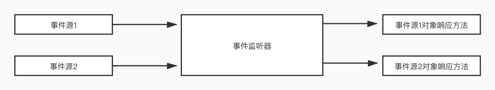

### 命令模式与JDK事件处理

* JDK事件处理机制如下图所示：

    
    
* 可以看出：事件源与对应的响应方法有事件监听器割裂开来，只有注册的事件源，才有可能进行方法响应。
    其主要功能如下
    
    * 事件监听器具有维护事件源信息的功能，既能注册事件源，又能撤销事件源
    
    * 当有事件（消息）发生的时候，事件监听器遍历监听的事件源信息，判断到底是
      哪个数据源产生的事件，若找到，则执行相应的消息响应方法
      
    * 事件监听器是Java消息处理机制的核心，由Java系统完成，因此，我们所做的只是完成
      注册事件源，以及在事件监听器机制下，在程序相应的位置编制相应的消息响应方法